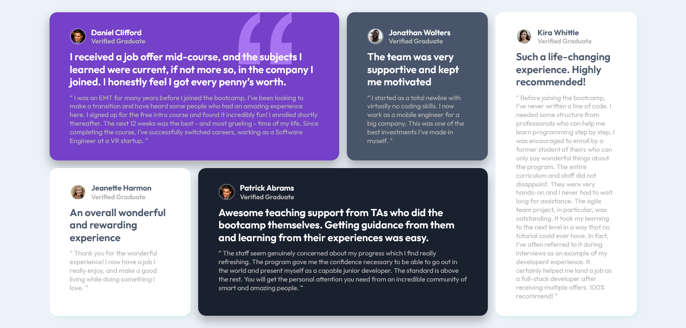
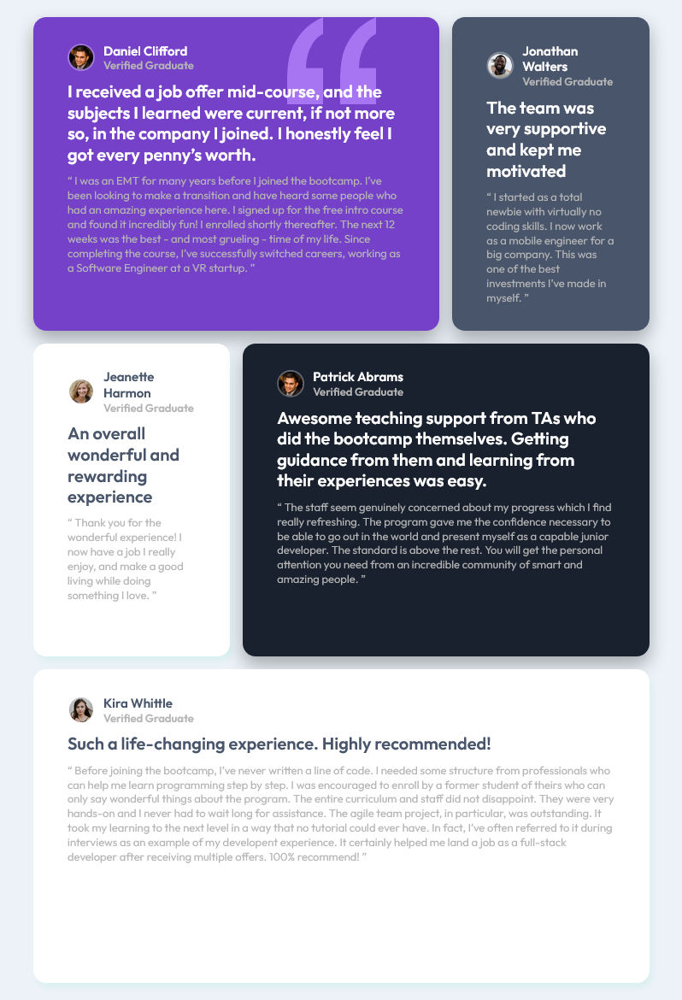
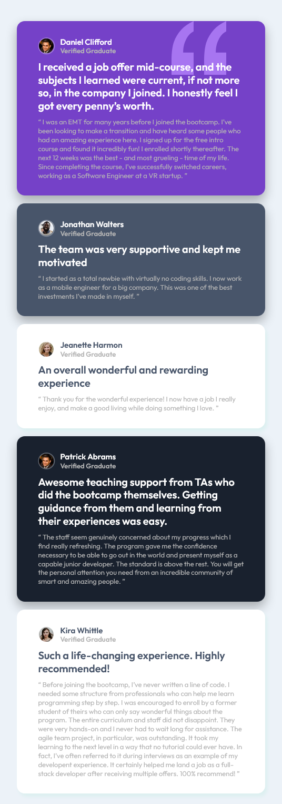

# Frontend Mentor - Testimonials grid section solution

This is a solution to the [Testimonials grid section challenge on Frontend Mentor](https://www.frontendmentor.io/challenges/testimonials-grid-section-Nnw6J7Un7). Frontend Mentor challenges help you improve your coding skills by building realistic projects. 

## Table of contents

- [Frontend Mentor - Testimonials grid section solution](#frontend-mentor---testimonials-grid-section-solution)
  - [Table of contents](#table-of-contents)
  - [Overview](#overview)
    - [The challenge](#the-challenge)
    - [Screenshot](#screenshot)
    - [Links](#links)
  - [My process](#my-process)
    - [Built with](#built-with)
    - [What I learned](#what-i-learned)
    - [Continued development](#continued-development)
  - [Author](#author)


## Overview

### The challenge

Users should be able to:

- View the optimal layout for the site depending on their device's screen size

### Screenshot





### Links

- Solution URL: [Github Repo](https://github.com/aminedh27/testimonials-grid-section-main)
- Live Site URL: [Github Pages](https://aminedh27.github.io/testimonials-grid-section-main/)

## My process

### Built with

- Semantic HTML5 markup
- CSS custom properties
- Flexbox
- CSS Grid
- Mobile-first workflow


### What I learned

In this challenge I became comfortable with CSS Flexbox and Grid and this is very useful for me to use them in Real world Projects

This is some of my code, see below:

```css
.grid-container {
  display: grid;
  max-width: 1150px;
  grid-template-columns: repeat(4, 1fr);
  grid-template-rows: 1fr 1fr;
  grid-gap: 15px;
}

.grid-item {
  /* border: 4px solid red; */
  display: flex;
  flex-direction: column;
  padding: 30px 40px;
  border-radius: 15px;
  box-shadow: 0 10px 20px rgba(0, 0, 0, 0.3);
}
```


### Continued development

I will continue learning Media Queries to make my code flexible and responsive

## Author

- Website - [DAHAH Amine](https://github.com/aminedh27)
- Frontend Mentor - [@aminedh27](https://www.frontendmentor.io/profile/aminedh27)
- Twitter - [@Amine_DH27](https://twitter.com/Amine_DH27)


